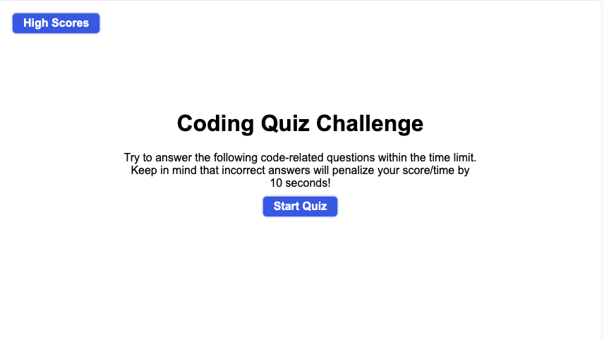
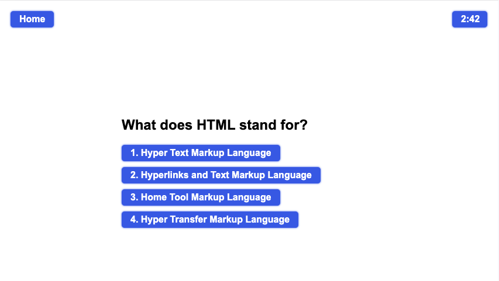
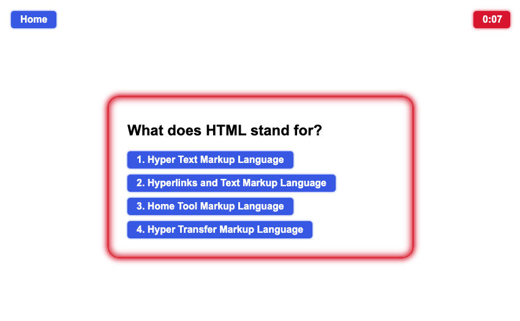
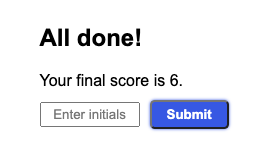
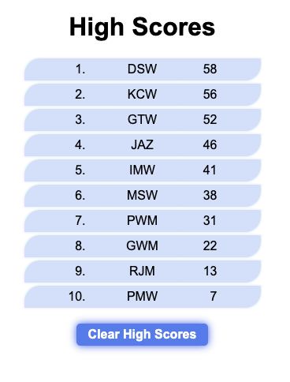

# Code Quiz

## Description 

For this project, I was tasked to create a web application that employed "dynamically updated HTML and CSS powered by JavaScript code" to present the user with a timed quiz on those same topics. The user could then take the quiz repeatedly, save their scores, and track their progress.

In order to implement what appeared from the mock-up to be an application with four separate "pages", I decided to create a single page that had four different sections, where each section could be dynamically "turned on" or "turned off" using the ```display.block``` and ```display.none``` styles. Instead of four separate pages, the application became a single page with four "modes".

Additional effort to make the quiz robust involved the detailed study and incorporation of numerous recently examined topics, including the following:

- Event listeners and event delegation
- Interval timers
- Input validation
- Object variables
- Saving to and retreival from Local Storage
- On-the-fly page modification using Javascript, ranging from simple formatting changes to showing and hiding page elements and entire sections

The project was an excellent opportunity to take multiple aspects of HTML, CSS, and JavaScript that I had worked on individually and build an application by combining them together in new ways. The effort was both challenging and rewarding, and my confidence in and understanding of these topics has improved significantly.

I deployed the application on [GitHub](https://github.com/) [Pages](https://pages.github.com/), and it can be found [here](https://d-a-v-i-d-w-r-i-g-h-t.github.io/code-quiz/).


## Installation

N/A

## Usage 

When the page loads, the user is presented with a welcome message and a **Start Quiz** button, shown below. There is also a button in the top left to jump straight to the High Scores page if the user desires.



On clicking the **Start Quiz** button, the user is presented with a series of multiple choice questions, one at a time, as shown below. Each question has four possible answers that the user can choose between with a mouse or touchpad/touchscreen, the four responses themselves being buttons. This makes the application accessible to mobile device users. The user can also input their answers with a keyboard, using number keys **1**, **2**, **3**, and **4**.



Upon selecting a correct answer, the answer is highlighted in green and a *Correct!* message is displayed under the question. If the selected answer is incorrect, the selected answer is highlighed in red, the correct answer is highlighted in green, and a *Wrong!* message is displayed under the question. The next question is then displayed after a brief delay.

In the quiz view, a countdown timer is displayed in the top right showing minutes and seconds remaining, and wrong answers are penalized with the subtraction of ten seconds. The button in the top left now says **Home** and will take the user back to the welcome page if desired.

At 30 seconds remaining, the timer turns red. At 15 seconds remaining, a glowing red border around the questions begins flashing. When all questions are answered or when time runs out, the quiz ends.



The user is then presented with their final score, equal to the number of seconds remaining when they finished answering all the questions. An input box with a **Submit** button is available for the user to enter their intials.



Upon submitting their initials, the user is then presented with the High Scores page where a list of up to ten high scores is displayed, sorted from highest to lowest, including the score they just received if it made the existing list. Scores are loaded from and saved to Local Storage and will persist between sessions. Under the list is a **Clear High Scores** button, which will empty the list and save the empty list to Local Storage. The **Home** button is again displayed in the top left.




## Credits

**List your collaborators, if any, with links to their GitHub profiles.**

**If you used any third-party assets that require attribution, list the creators with links to their primary web presence in this section.**

**If you followed tutorials, include links to those here as well.**


I learned about CSS style transition effects from [W3schools](https://www.w3schools.com/), [CSS Transitions](https://www.w3schools.com/css/css3_transitions.asp).

I learned about using the ```forEach()``` method to modify the stile of all elements in a class from [Borislav Hadzhiev](https://bobbyhadz.com/), [Change a Style of all Elements with a specific Class in JS
](https://bobbyhadz.com/blog/javascript-change-style-of-all-elements-with-class).

The template for this README file was provided by [edX Boot Camps](https://www.edx.org/boot-camps).

The fantastic list of 50 questions, each with four multiple choice responses together with their correct answer, was provided already formatted in my requested object variable structure, by [ChatGPT-3.5](https://chat.openai.com/) from [OpenAI](https://openai.com/).


## License

Please refer to the LICENSE in the repo.
